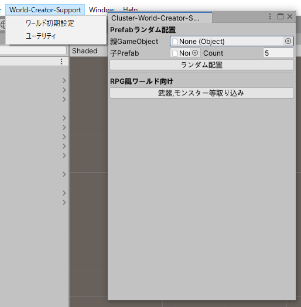
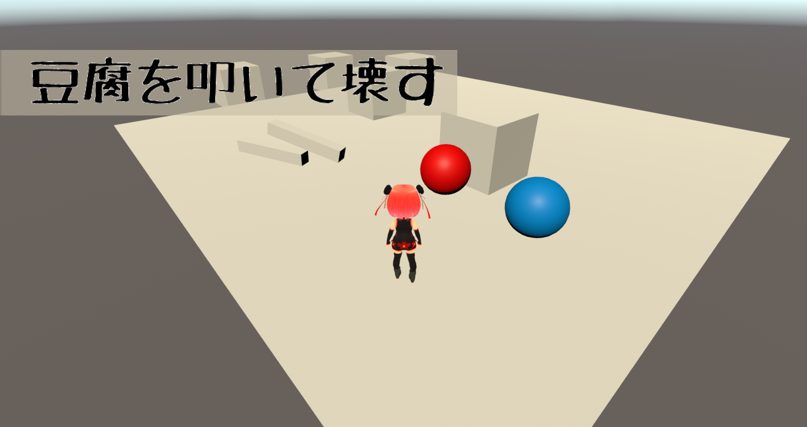

# Cluster-World-Creator-Support
1ボタンでワールドに必要な要素を配置したり、ゲーム作成に便利な機能をUnityに追加する  
Unityエディタ拡張スクリプト

# 機能

ツール  
- 1ボタンでワールドに必要な要素を配置  
- シーンへの指定Prefabのランダム配置

RPGワールド向けツール
- RPG風ゲームの元になるObjectの生成  
    - スタート,リセット ボタン  
    - ウロウロするターゲット  
    - ターゲットのHP設定  
    - 手に持つことができる棒アイテム  
    - ターゲットのHPが減ると別アイテムを表示して消える機能  

# サンプルワールド
World-Creator-Support Unitエディター拡張スクリプト で作ったゲーム  
うろうろする豆腐を棒で叩いて壊す RPG風サンプル です。

https://cluster.mu/w/c98bc16f-a21e-42f9-a0ce-b4f2ebc5bde2
